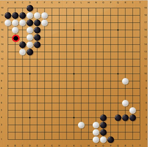

# Interpreting 'Go' moves

It takes a serious mastery to understand moves of Go. After the success of AlphaGo, it became almost impossible to understand how the agent is playing the game, and raised question of interpretability of deep RL agents and their real life deployment.

[SARFA](https://arxiv.org/abs/1912.12191) attempts to explain moves of prominent Go agents like [minigo](https://github.com/tensorflow/minigo). 'minigo' is an implementation of a neural-network based Go AI, using TensorFlow. It is inspired by DeepMind's AlphaGo algorithm.


## Example of SARFA explaining a Go position

*Board setup along with its explanation by SARFA* 

    

The agent playing black plays B15 in given position. 

What does SARFA say about it? - SARFA explanation highlights white pieces on (A17, B17, C17 and B16) along with the black flank on E line, suggesting a capture of those with the help of E-flank.


Above is a [standard puzzle](https://online-go.com/puzzle/10), where black tries to save its three pieces(A18, B18 and C18).
If we rollout the puzzle, we could see how SARFA explanation fits here. 


# How to run the code

1. Setting up 'minigo' 
    - Download 'minigo'  from 
        ```sh
        github.com/tensorflow/minigo
        ```
    - Copy all the files from 'sarfa-saliency/go' to 'minigo' folder.
    - Download weights of a minigo model from 
        ```sh
        https://drive.google.com/open?id=1HLwxTqbGWxZRu4tOqTJjoqXOLue3JOVw
        ```
        Extract this folder in 'minigo' such that path to it becomes 'minigo/minigo-models'.
2. Setting up the game by editing 'go_saliency.py' file.(**Note**: Default board size is 19. Code requires black's turn to play.)
    - Download puzzles from popular websites such as [OGS](https://online-go.com/puzzles) in [SGF](https://en.wikipedia.org/wiki/Smart_Game_Format) format into the folder 'go_puzzles'. 
    - Give path to puzzle by changing line 320 in 'go_saliency.py' 
3. Getting SARFA explanations 
    - Run command 
        ```sh
        python3 go_saliency.py
        ```
    - See the output saved as 'entropy.png' in 'results' folder
